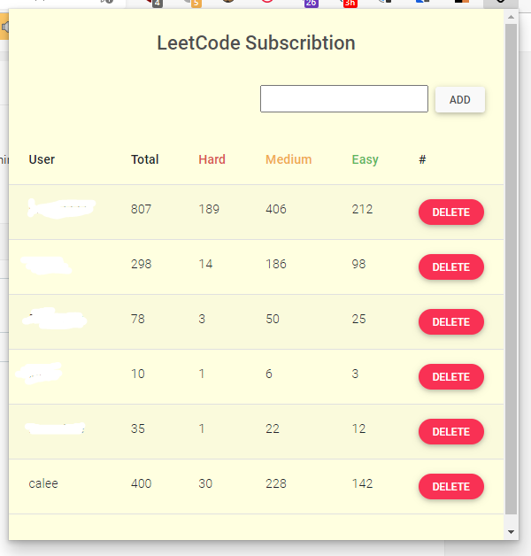

# leetcode-following

A Chrome/Edge extension to follow friends on LeetCode

## What is this

There is an [issue](https://leetcode.com/discuss/feedback/261518/is-there-a-way-to-search-and-follow-users-in-leetcode/1424994) about following friends on LeetCode. Because of the feature is not yet right now, I implemented thsi simple extension to follow friends on LeetCode.
Thanks to JeremyTsaii, the API I'm using is call from [the project](https://github.com/JeremyTsaii/leetcode-stats-api) (`https://leetcode-stats-api.herokuapp.com/`).

## How to install

Download the project to your local. Goes to Chrome/Edge extension manager and press `Load unpacked`. Select the folder / zip file you have downloaded and join it!

## How to used it

Input your friends' LeetCode ID with `ADD` buttom. Or delete users if you want.

## known issues

- The api is using by third-party from [JeremyTsaii/leetcode-stats-api](https://github.com/JeremyTsaii/leetcode-stats-api) but not using the origin API from LeetCode because I don't know how to deal with CSRF.
- It used chrome extension local storage to save user so it's not promise store perminently.
- The extension will query API every when we view it. There may be improve by some cacheing method.
